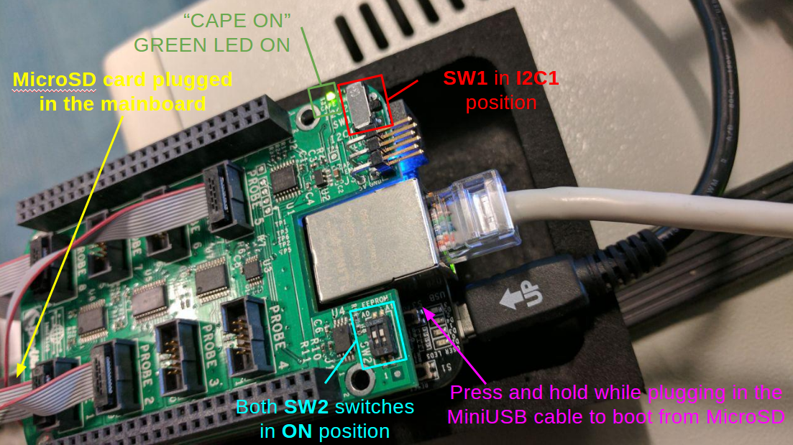

***************
Energy analysis
***************

Introduction
============

As part of the `EAS
<https://community.arm.com/developer/ip-products/processors/b/processors-ip-blog/posts/energy-aware-scheduling-in-linux?_ga=2.199018799.1628257541.1552386902-104220551.1546441490>`_
development efforts, support for CPU energy models and energy probes was added
to LISA.

Energy model
============

The :class:`~lisa.energy_model.EnergyModel` class mimics the energy model used
by EAS, and lets us do some energy analysis.

.. tip::

   An :class:`~lisa.energy_model.EnergyModel` instance can be generated from a
   live target using :meth:`~lisa.energy_model.EnergyModel.from_target`,
   providing this target does have an energy model.

Its most noteworthy use is in our :meth:`EAS behavioural tests
<lisa.tests.scheduler.eas_behaviour.EASBehaviour.test_task_placement()>`, as it lets us
estimate the amount of energy consumed in an execution trace and compare this
to an estimated energy-optimal placement.

.. seealso:: See :class:`~lisa.energy_model.EnergyModel` for more details.

Energy meters
=============

All energy meters inherit from :class:`lisa.energy_meter.EnergyMeter`, and most
of them use one of devlib's :mod:`devlib.instrument` under the hood.

.. seealso:: See :class:`~lisa.energy_meter.EnergyMeter` for more details.

HWMON
+++++

The ``hwmon`` is a generic Linux kernel subsystem, providing access to hardware
monitoring components like temperature or voltage/current sensors.

.. TODO:: code snippet

Arm Energy probe (AEP)
++++++++++++++++++++++

ARM Energy Probes are lightweight power measurement tools for software
developers. They can monitor up to three voltage rails simultaneously.

.. seealso:: Its related class is :class:`~lisa.energy_meter.AEP`.

Equipment
---------

The required equipment is the following:

* An ARM Energy Probe
* A shunt resistor to be connected between the voltage rail and the probe. The voltage drop
  on the resistor must be at most 165 mv. Therefore depending on the maximum current required
  by the load, one can properly select the value of the shunt resistor
* Install ``caiman`` required libraries:

  .. code-block:: sh

     sudo apt-get install libudev-dev

* Clone, compile and install the `caiman <https://github.com/ARM-software/caiman>`_ tool.

  .. code-block:: sh

     git clone https://github.com/ARM-software/caiman.git
     cd caiman/caiman && cmake . && make && cd -
     cp caiman/caiman /usr/bin

.. image:: https://developer.arm.com/-/media/developer/products/software-tools/ds-5-development-studio/images/ARM%20Energy%20Probe/ARM_Energy_Probe_4.png?h=378&w=416&hash=90D98087E80D9178CCC28026C1C8E476A6736D09&hash=90D98087E80D9178CCC28026C1C8E476A6736D09&la=en
   :alt: Arm Energy Probe

Baylibre ACME cape
++++++++++++++++++

The ``iiocapture`` instrument exploits the `BayLibre ACME
<http://baylibre.com/acme/>`_ solution for measuring power.

To use this instrument you need the following hardware:

* A `BeagleBone Black <https://beagleboard.org/black>`_
* An `ACME Cape <http://sigrok.org/wiki/BayLibre_ACME>`_
* Power probes for the ACME Cape

.. seealso:: Its related class is :class:`~lisa.energy_meter.ACME`.

Setting up the board
--------------------

First step is to get an **IIO version** of the ACME BeagleBone black image. The
recommended way of using ACME is to use the `pre-built image
<https://github.com/baylibre-acme/ACME/releases/download/b1/acme-beaglebone-black_b1-sdcard-image.xz>`_
provided by BayLibre.

If you are using a MicroSD card, please ensure that the card is properly
inserted in its slot and to keep pressed the power push-button while connecting
the power (via the miniUSB cable). Here is an image of the configuration we
usually use:

To change the IP address and avoid a buggy route to a /8 to be added on your host,
change the address of the board in ``/usr/bin/acme-usbgadget-udhcpd``:

.. code-block:: sh

   # Use an address that does not clash with your existing networks
   #ifconfig usb0 up 10.65.34.1 netmask 255.255.255.0
   ifconfig usb0 up 192.168.50.1 netmask 255.255.255.0

Fix the DHCP server config on the ACME board to advertise a small subnet instead
of a whole /8:

.. code-block:: sh

   #start          10.65.34.20     #default: 192.168.0.20
   #end            10.65.34.254    #default: 192.168.0.254

   # Advertise a /24 subnet which contains both the
   #allocated addresses and the address of the board itself
   option  subnet  255.255.255.0
   start           192.168.50.20
   end             192.168.50.254

Once the board is booted, by default it has its IP address associated with the
``baylibre-acme.local`` hostname. To check for the board being visible in your
network, you can use this command

.. code-block:: sh

   avahi-browse -a

which will list all the reachable devices.

If you do not want to use avahi, you can refer to it by the static IP of the
ethernet-over-USB interface. That has the added benefit of not using the board
of somebody else, since that IP is on the USB interface which can only be
accessed from your local machine.

Setting up iio-capture
----------------------

Install the ``iio-capture`` tool required libraries:

* If ``libiio-*`` is available from the repositories in your ``apt-get``, then run
  ``sudo apt-get install libiio-utils libiio-dev``
* Otherwise, follow the instructions on the `libiio
  wiki <https://wiki.analog.com/resources/tools-software/linux-software/libiio>`_
  on how to build it
* Clone, compile and install the `iio-capture tool <https://github.com/BayLibre/iio-capture>`_

.. code-block:: sh

   git clone https://github.com/BayLibre/iio-capture.git
   cd iio-capture && make && sudo make install && cd -

You can now verify your installation and check that the probes are correctly
detected by the ``iio daemon`` running on the BeagleBone with a simple command:

.. code-block:: sh

   iio_info -n baylibre-acme.local

If you have any issues, for example if ``iio_info`` hangs, or ``iio-capture``
reports "Unsupported write attribute 'in_oversampling_ratio'", try rebooting the
ACME by SSH:

.. code-block:: sh

   # (replace baylibre-acme.local if you changed the hostname)
   ssh root@baylibre-acme.local reboot

Monsoon Power Monitor
+++++++++++++++++++++

The ``Monsoon`` energy meter allows collecting data from Monsoon Solutions Inc's
Power Monitor.

.. seealso:: Its related class is :class:`~lisa.energy_meter.Monsoon`.

Setup
-----

This meter depends on the monsoon.py script from AOSP. To set this up, download
that script from `here
<https://android.googlesource.com/platform/cts/+/master/tools/utils/monsoon.py>`_
and run ``pip install gflags pyserial``.

The Power Monitor acts as a power supply as well as an energy meter. LISA
doesn't currently automate setting this up. You'll need to manually run these
commands:

API
===

Energy model
++++++++++++

.. automodule:: lisa.energy_model
   :members:
   :private-members: _CpuTree

Energy meters
+++++++++++++

.. automodule:: lisa.energy_meter
   :members:
   :private-members: _DevlibContinuousEnergyMeter
