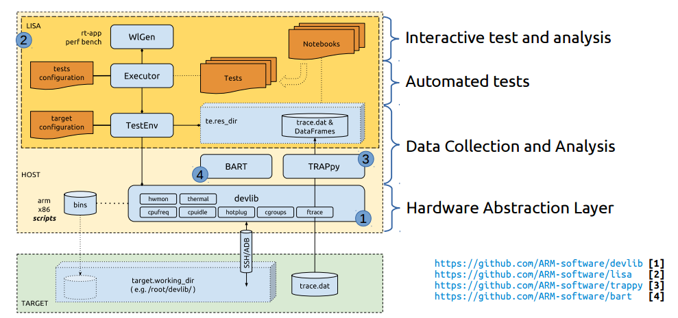

.. LISA documentation master file, created by
   sphinx-quickstart on Tue Dec 13 14:20:00 2016.
   You can adapt this file completely to your liking, but it should at least
   contain the root `toctree` directive.

LISA Documentation
==============================================

LISA - "Linux Integrated System Analysis" is a toolkit for interactive analysis
and automated regression testing of Linux kernel behaviour.

See :ref:`install` for info on setup and usage. See :ref:`getting-started` to
get up and running using LISA.

Lisa is hosted on Github at https://github.com/ARM-software/lisa.

This site contains documentation for LISA's APIs. For some parts of LISA, API
documentation is a work-in-progress. Where the API documentation is lacking, see
the example/tutorial notebooks provided with LISA, or just dive in and read the
code. Contributions to LISA and its documentation are very welcome, and handled
via Github pull requests.

What is LISA?
=================

LISA helps Linux kernel developers to measure the impact of modifications in
core parts of the kernel. The focus is on the scheduler, power management and
thermal frameworks. Nevertheless, LISA is generic and can be used for other
purposes too.

.. TODO link to APIs mentioned

LISA provides an API for modelling use-cases of interest and developing
regression tests for use-cases. A ready made set of test-cases to support
regression testing of core kernel features is provided. In addition, LISA uses
the excellent IPython Notebook framework and a set of example notebooks for live
experiments on a target platform.

Goals & Motivation
=========================
The main goals of LISA are:

-  Support study of existing behaviours (i.e. *“how does PELT work?”*)
-  Support analysis of new code being developed (i.e. *“what is the
   impact on existing code?”*)
-  Get insights on what’s not working and possibly chase down why
-  Share reproducible experiments by means of a **common language**
   that:

   -  is **flexible enough** to reproduce the same experiment on
      different targets
   -  **simplifies** generation and execution of well defined workloads
   -  **defines** a set of metrics to evaluate kernel behaviours
   -  **enables** kernel developers to easily post process data to
      produce statistics and plots

Overall Design View
~~~~~~~~~~~~~~~~~~~~~

.. TODO move this to its own page going over the design & implementation

External Links
~~~~~~~~~~~~~~

-  Linux Integrated System Analysis (LISA) & Friends `Slides`_ and
   `Video`_

.. _Slides: http://events.linuxfoundation.org/sites/events/files/slides/ELC16_LISA_20160326.pdf
.. _Video: https://www.youtube.com/watch?v=yXZzzUEngiU

.. _Readme:

Documentatoin Contents:
=================================

.. TODO: due to our slightly weird package structure the index here is wildly
   nested where it needn't be.

.. toctree::

   install
   getting_started
   modules

Indices and tables
==================

* :ref:`genindex`
* :ref:`modindex`
* :ref:`search`

Building this documentation
==============================
- Install ``sphinx-doc``
- From the root of the LISA source tree: ``source init_env && make -C doc/ html``
- Find the HTML in ``doc/_build/html``
