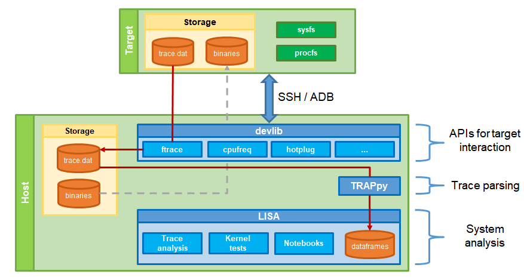

********
Overview
********

The LISA project provides a toolkit that supports regression testing and
interactive analysis of Linux kernel behavior. LISA stands for Linux
Integrated/Interactive System Analysis. LISA's goal is to help Linux kernel
developers measure the impact of modifications in core parts of the
kernel. The focus is on the scheduler (e.g. EAS), power management and thermal
frameworks. However LISA is generic and can be used for other purposes.

LISA has a "host"/"target" model. LISA itself runs on a host machine, and uses
the devlib toolkit to interact with the target via SSH, ADB or telnet. LISA is
flexible with regard to the target OS; its only expectation is a Linux
kernel-based system. Android, GNU/Linux and busybox style systems have all been
used.

LISA provides features to describe workloads (notably using rt-app) and run
them on targets. It can collect trace files from the target OS (e.g. systrace
and ftrace traces) and parse them. These traces can then be parsed and analysed
in order to examine detailed target behaviour during the workload's execution.

