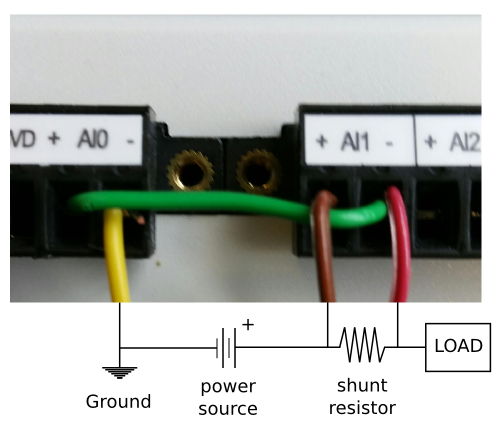

.. _daq_setup:

DAQ Server Guide
================

NI-DAQ, or just "DAQ", is the Data Acquisition device developed by National
Instruments:

        http://www.ni.com/data-acquisition/

WA uses the DAQ to collect power measurements during workload execution. A
client/server solution for this is distributed as part of WA, though it is
distinct from WA and may be used separately (by invoking the client APIs from a
Python script, or used directly from the command line).

This solution is dependent on the NI-DAQmx driver for the DAQ device. At the
time of writing, only Windows versions of the driver are supported (there is an
old Linux version that works on some versions of RHEL and Centos, but it is
unsupported and won't work with recent Linux kernels). Because of this, the
server part of the solution will need to be run on a Windows machine (though it
should also work on Linux, if the driver becomes available).

.. _daq_wiring:

DAQ Device Wiring
-----------------

The server expects the device to be wired in a specific way in order to be able
to collect power measurements. Two consecutive Analogue Input (AI) channels on
the DAQ are used to form a logical "port" (starting with AI/0 and AI/1 for port
0). Of these, the lower/even channel (e.g. AI/0) is used to measure the voltage
on the rail we're interested in; the higher/odd channel (e.g. AI/1) is used to
measure the voltage drop across a known very small resistor on the same rail,
which is then used to calculate current. The logical wiring diagram looks like 
this::

        Port N
        ======
        |
        |   AI/(N*2)+   <--- Vr -------------------------|
        |                                                |
        |   AI/(N*2)-   <--- GND -------------------//   |
        |                                                |
        |   AI/(N*2+1)+ <--- V  ------------|-------V    |
        |                           r       |            |
        |   AI/(N*2+1)- <--- Vr --/\/\/\----|            |
        |                 |                              |
        |                 |                              |
        |                 |------------------------------|
        ======

        Where:
                V: Voltage going into the resistor
                Vr: Voltage between resistor and the SOC
                GND: Ground
                r: The resistor across the rail with a known
                   small value.
                

The physical wiring will depend on the specific DAQ device, as channel layout
varies between models.

.. note:: Current solution supports variable number of ports, however it
          assumes that the ports are sequential and start at zero. E.g. if you
          want to measure power on three rails, you will need to wire ports 0-2
          (AI/0 to AI/5 channels on the DAQ) to do it. It is not currently
          possible to use any other configuration (e.g. ports 1, 2 and 5).

As an example, the following illustration shows the wiring of PORT0 (using AI/0
and AI/1 channels) on a DAQ USB-6210

Setting up NI-DAQmx driver on a Windows Machine
-----------------------------------------------

   - The NI-DAQmx driver is pretty big in size, 1.5 GB. The driver name is 
     'NI-DAQmx' and its version '9.7.0f0' which you can obtain it from National 
     Instruments website by downloading NI Measurement & Automation Explorer (Ni 
     MAX) from: http://joule.ni.com/nidu/cds/view/p/id/3811/lang/en

     .. note:: During the installation process, you might be prompted to install 
              .NET framework 4.
      
   - The installation process is quite long, 7-15 minutes.
   - Once installed, open NI MAX, which should be in your desktop, if not type its
     name in the start->search.
   - Connect the NI-DAQ device to your machine. You should see it appear under
     'Devices and Interfaces'. If not, press 'F5' to refresh the list.
   - Complete the device wiring as described in the :ref:`daq_wiring` section.
   - Quit NI MAX.

Setting up DAQ server
---------------------

The DAQ power measurement solution is implemented in daqpower Python library,
the package for which can be found in WA's install location under
``wlauto/external/daq_server/daqpower-1.0.0.tar.gz`` (the version number in your
installation may be different).

  - Install NI-DAQmx driver, as described in the previous section.
  - Install Python 2.7.
  - Download and install ``pip``, ``numpy`` and ``twisted`` Python packages.
    These packages have C plugins, an so you will need a native compiler set
    up if you want to install them from PyPI. As an easier alternative, you can
    find pre-built Windows installers for these packages here_ (the versions are
    likely to be older than what's on PyPI though).
  - Install the daqpower package using pip::

        pip install C:\Python27\Lib\site-packages\wlauto\external\daq_server\daqpower-1.0.0.tar.gz

    This should automatically download and install ``PyDAQmx`` package as well
    (the Python bindings for the NI-DAQmx driver).

.. _here: http://www.lfd.uci.edu/~gohlke/pythonlibs/

Running DAQ server
------------------

Once you have installed the ``daqpower`` package and the required dependencies as
described above, you can start the server by executing ``run-daq-server`` from the
command line. The server will start listening on the default port, 45677.

.. note:: There is a chance that pip will not add ``run-daq-server`` into your
          path. In that case, you can run daq server as such:
          ``python C:\path to python\Scripts\run-daq-server``

You can optionally specify flags to control the behaviour or the server::

        usage: run-daq-server [-h] [-d DIR] [-p PORT] [--debug] [--verbose]

        optional arguments:
        -h, --help            show this help message and exit
        -d DIR, --directory DIR
                                Working directory
        -p PORT, --port PORT  port the server will listen on.
        --debug               Run in debug mode (no DAQ connected).
        --verbose             Produce verobose output.

.. note:: The server will use a working directory (by default, the directory
          the run-daq-server command was executed in, or the location specified
          with -d flag) to store power traces before they are collected by the
          client. This directory must be read/write-able by the user running
          the server.

Collecting Power with WA
------------------------

.. note:: You do *not* need to install the ``daqpower`` package on the machine
          running WA, as it is already included in the WA install structure.
          However, you do need to make sure that ``twisted`` package is
          installed.

You can enable ``daq`` instrument your agenda/config.py in order to get WA to
collect power measurements. At minimum, you will also need to specify the
resistor values for each port in your configuration, e.g.::

        resistor_values = [0.005, 0.005]  # in Ohms

This also specifies the number of logical ports (measurement sites) you want to
use, and, implicitly, the port numbers (ports 0 to N-1 will be used). 

.. note:: "ports" here refers to the logical ports wired on the DAQ (see :ref:`daq_wiring`, 
          not to be confused with the TCP port the server is listening on.

Unless you're running the DAQ server and WA on the same machine (unlikely
considering that WA is officially supported only on Linux and recent NI-DAQmx 
drivers are only available on Windows), you will also need to specify the IP
address of the server::

        daq_server =  127.0.0.1

There are a number of other settings that can optionally be specified in the
configuration (e.g. the labels to be used for DAQ ports). Please refer to the
:class:`wlauto.instrumentation.daq.Daq` documentation for details.

Collecting Power from the Command Line
--------------------------------------

``daqpower`` package also comes with a client that may be used from the command
line. Unlike when collecting power with WA, you *will* need to install the
``daqpower`` package. Once installed, you will be able to interract with a
running DAQ server by invoking ``send-daq-command``. The invocation syntax is ::

        send-daq-command --host HOST [--port PORT] COMMAND [OPTIONS]

Options are command-specific. COMMAND may be one of the following (and they
should generally be inoked in that order):

        :configure: Set up a new session, specifying the configuration values to
                    be used. If there is already a configured session, it will
                    be terminated. OPTIONS for this this command are the DAQ
                    configuration parameters listed in the DAQ instrument
                    documentation with all ``_`` replaced by ``-`` and prefixed
                    with ``--``, e.g. ``--resistor-values``.
        :start: Start collecting power measurments.
        :stop: Stop collecting power measurments.
        :get_data:  Pull files containg power measurements from the server.
                    There is one option  for this command:
                    ``--output-directory`` which specifies where the files will
                    be pulled to; if this is not specified, the will be in the
                    current directory.
        :close: Close the currently configured server session. This will get rid
                of  the data files and configuration on the server, so it would 
                no longer be possible to use "start" or "get_data" commands
                before a new session is configured.

A typical command line session would go like this:

.. code-block:: bash

        send-daq-command --host 127.0.0.1 configure --resistor-values 0.005 0.005
        # set up and kick off the use case you want to measure
        send-daq-command --host 127.0.0.1 start
        # wait for the use case to complete
        send-daq-command --host 127.0.0.1 stop
        send-daq-command --host 127.0.0.1 get_data
        # files called PORT_0.csv and PORT_1.csv will appear in the current directory
        # containing measurements collected during use case execution
        send-daq-command --host 127.0.0.1 close
        # the session is terminated and the csv files on the server have been
        # deleted. A new session may now be configured.

In addtion to these "standard workflow" commands, the following commands are
also available:

        :list_devices: Returns a list of DAQ devices detected by the NI-DAQmx
                       driver. In case mutiple devices are connected to the
                       server host, you can specify the device you want to use
                       with ``--device-id`` option when configuring a session.
        :list_ports: Returns a list of ports tha have been configured for the 
                     current session, e.g. ``['PORT_0', 'PORT_1']``.
        :list_port_files: Returns a list of data files that have been geneted
                          (unless something went wrong, there should be one for
                          each port).

Collecting Power from another Python Script
-------------------------------------------

You can invoke the above commands from a Python script using
:py:func:`daqpower.client.execute_command` function, passing in
:class:`daqpower.config.ServerConfiguration` and, in case of the configure command,
:class:`daqpower.config.DeviceConfigruation`. Please see the implementation of
the ``daq`` WA instrument for examples of how these APIs can be used.
