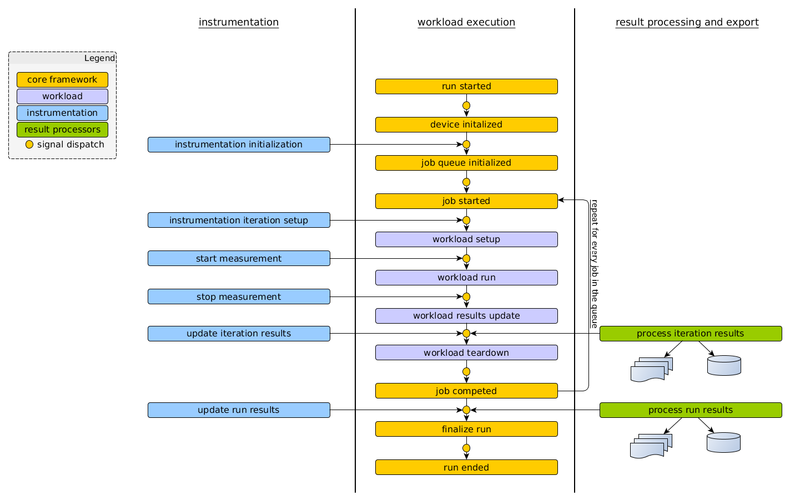

++++++++++++++++++
Framework Overview
++++++++++++++++++

Execution Model
===============

At the high level, the execution model looks as follows:

After some initial setup, the framework initializes the device, loads and initialized
instrumentation and begins executing jobs defined by the workload specs in the agenda. Each job
executes in four basic stages:

setup
        Initial setup for the workload is performed. E.g. required assets are deployed to the
        devices, required services or applications are launched, etc. Run time configuration of the
        device for the workload is also performed at this time.

run
        This is when the workload actually runs. This is defined as the part of the workload that is
        to be measured. Exactly what happens at this stage depends entirely on the workload.

result processing
        Results generated during the execution of the workload, if there are any, are collected,
        parsed and extracted metrics are passed up to the core framework.

teardown
        Final clean up is performed, e.g. applications may closed, files generated during execution
        deleted, etc.

Signals are dispatched (see signal_dispatch_ below) at each stage of workload execution,
which installed instrumentation can hook into in order to collect measurements, alter workload
execution, etc.  Instrumentation implementation usually mirrors that of workloads, defining
setup, teardown and result processing stages for a particular instrument. Instead of a ``run``,
instruments usually implement a ``start`` and a ``stop`` which get triggered just before and just
after a workload run.  However, the signal dispatch mechanism give a high degree of flexibility
to instruments allowing them to hook into almost any stage of a WA run (apart from the very
early initialization).

Metrics and artifacts generated by workloads and instrumentation are accumulated by the framework
and are then passed to active result processors. This happens after each individual workload
execution and at the end of the run. A result process may chose to act at either or both of these
points.

Control Flow
============

This section goes into more detail explaining the relationship between the major components of the
framework and how control passes between them during a run. It will only go through the major
transition and interactions and will not attempt to describe very single thing that happens.

.. note:: This is the control flow for the ``wa run`` command which is the main functionality 
          of WA. Other commands are much simpler and most of what is described below does not
          apply to them.

#. ``wlauto.core.entry_point`` parses the command form the arguments and executes the run command 
   (``wlauto.commands.run.RunCommand``).
#. Run command initializes the output directory and creates a ``wlauto.core.agenda.Agenda`` based on
   the command line arguments. Finally, it instantiates  a ``wlauto.core.execution.Executor`` and
   passes it the Agenda.
#. The Executor uses the Agenda to create a ``wlauto.core.configuraiton.RunConfiguration`` fully
   defines the configuration for the run (it will be serialised into ``__meta`` subdirectory under
   the output directory.
#. The Executor proceeds to instantiate and install instrumentation, result processors and the
   device interface, based on the RunConfiguration. The executor also initialise a
   ``wlauto.core.execution.ExecutionContext`` which is used to track the current state of the run
   execution and also serves as a means of communication between the core framework and the
   plugins.
#. Finally, the Executor instantiates a ``wlauto.core.execution.Runner``, initializes its job
   queue with workload specs from the RunConfiguraiton, and kicks it off.
#. The Runner performs the run time initialization of the device and goes through the workload specs
   (in the order defined by ``execution_order`` setting), running each spec according to the
   execution model described in the previous section. The Runner sends signals (see below) at
   appropriate points during execution.
#. At the end of the run, the control is briefly passed back to the Executor, which outputs a
   summary for the run.

.. _signal_dispatch:

Signal Dispatch
===============

WA uses the `louie <https://pypi.python.org/pypi/Louie/1.1>`_ (formerly, pydispatcher) library 
for signal dispatch. Callbacks can be registered for signals emitted during the run. WA uses a
version of louie that has been modified to introduce priority to registered callbacks (so that
callbacks that are know to be slow can be registered with a lower priority so that they do not
interfere with other callbacks).

This mechanism is abstracted for instrumentation. Methods of an :class:`wlauto.core.Instrument`
subclass automatically get hooked to appropriate signals based on their names when the instrument 
is "installed" for the run. Priority can be specified by adding ``very_fast_``, ``fast_`` , 
``slow_`` or ``very_slow_`` prefixes to method names. 

The full list of method names and the signals they map to may be viewed 
:ref:`here <instrumentation_method_map>`.

Signal dispatching mechanism may also be used directly, for example to dynamically register 
callbacks at runtime or allow plugins other than ``Instruments`` to access stages of the run
they are normally not aware of.

The sending of signals is the responsibility of the Runner. Signals gets sent during transitions
between execution stages and when special evens, such as errors or device reboots, occur.

See Also
--------

.. toctree::
    :maxdepth: 1

    instrumentation_method_map
