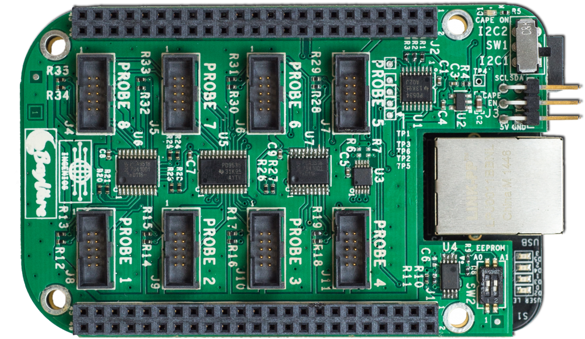
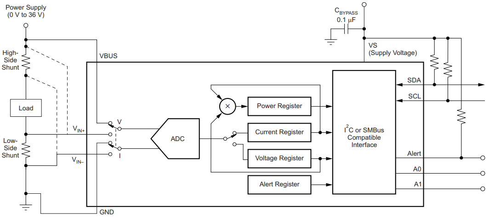
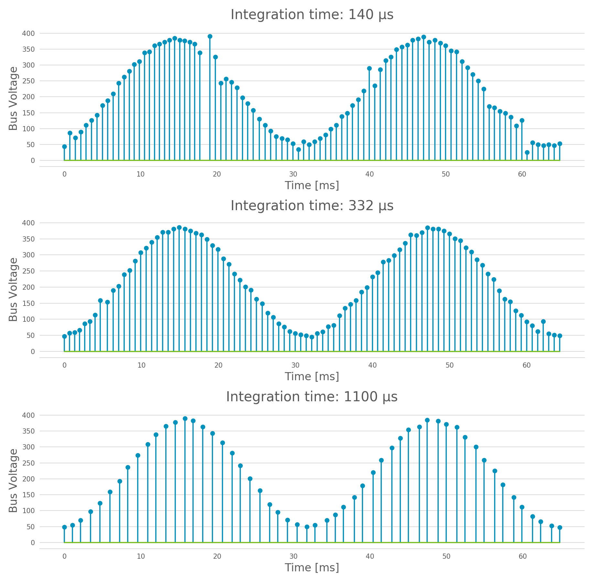
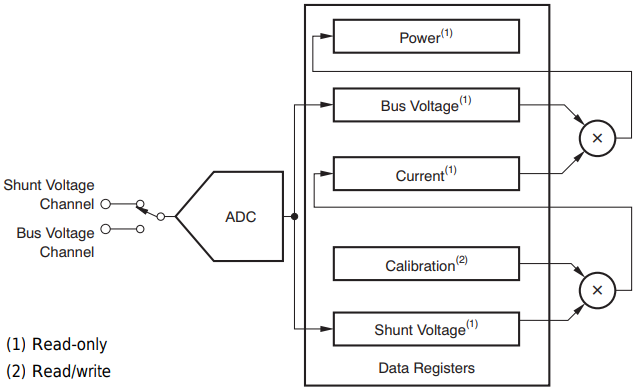
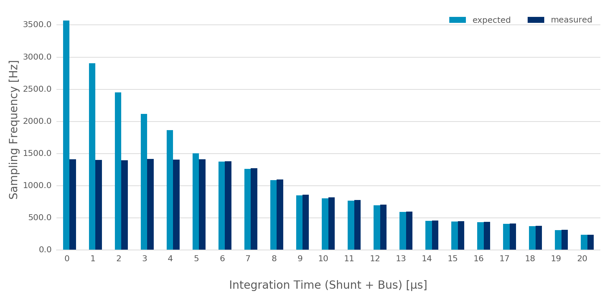
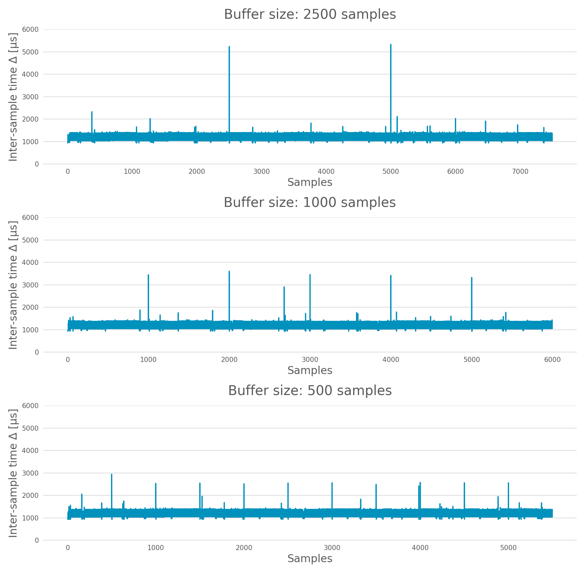

Instrumentation
===============

The ``Instrument`` API provide a consistent way of collecting measurements from
a target. Measurements are collected via an instance of a class derived from
:class:`Instrument`. An ``Instrument`` allows collection of measurement from one
or more channels. An ``Instrument`` may support ``INSTANTANEOUS`` or
``CONTINUOUS`` collection, or both.

Example
-------

The following example shows how to use an instrument to read temperature from an
Android target.

.. code-block:: python

    # import and instantiate the Target and the instrument
    # (note: this assumes exactly one android target connected
    #  to the host machine).
    In [1]: from devlib import AndroidTarget, HwmonInstrument

    In [2]: t = AndroidTarget()

    In [3]: i = HwmonInstrument(t)

    # Set up the instrument on the Target. In case of HWMON, this is
    # a no-op, but is included here for completeness.
    In [4]: i.setup()

    # Find out what the instrument is capable collecting from the
    # target.
    In [5]: i.list_channels()
    Out[5]:
    [CHAN(battery/temp1, battery_temperature),
     CHAN(exynos-therm/temp1, exynos-therm_temperature)]

    # Set up a new measurement session, and specify what is to be
    # collected.
    In [6]: i.reset(sites=['exynos-therm'])

    # HWMON instrument supports INSTANTANEOUS collection, so invoking
    # take_measurement() will return a list of measurements take from
    # each of the channels configured during reset()
    In [7]: i.take_measurement()
    Out[7]: [exynos-therm_temperature: 36.0 degrees]

API
---

Instrument
~~~~~~~~~~

.. class:: Instrument(target, \*\*kwargs)

   An ``Instrument`` allows collection of measurement from one or more
   channels. An ``Instrument`` may support ``INSTANTANEOUS`` or ``CONTINUOUS``
   collection, or both.

.. attribute:: Instrument.mode

   A bit mask that indicates collection modes that are supported by this
   instrument. Possible values are:

   :INSTANTANEOUS: The instrument supports taking a single sample via
                   ``take_measurement()``.
   :CONTINUOUS: The instrument supports collecting measurements over a
                period of time via ``start()``, ``stop()``, ``get_data()``,
		and (optionally) ``get_raw`` methods.

   .. note:: It's possible for one instrument to support more than a single
             mode.

.. attribute:: Instrument.active_channels

   Channels that have been activated via ``reset()``. Measurements will only be
   collected for these channels.

.. method:: Instrument.list_channels()

   Returns a list of :class:`InstrumentChannel` instances that describe what
   this instrument can measure on the current target. A channel is a combination
   of a ``kind`` of measurement (power, temperature, etc) and a ``site`` that
   indicates where on the target the measurement will be collected from.

.. method:: Instrument.get_channels(measure)

   Returns channels for a particular ``measure`` type. A ``measure`` can be
   either a string (e.g. ``"power"``) or a :class:`MeasurmentType` instance.

.. method::  Instrument.setup(\*args, \*\*kwargs)

   This will set up the instrument on the target. Parameters this method takes
   are particular to subclasses (see documentation for specific instruments
   below).  What actions are performed by this method are also
   instrument-specific.  Usually these will be things like  installing
   executables, starting services, deploying assets, etc. Typically, this method
   needs to be invoked at most once per reboot of the target (unless
   ``teardown()`` has been called), but see documentation for the instrument
   you're interested in.

.. method:: Instrument.reset(sites=None, kinds=None, channels=None)

   This is used to configure an instrument for collection. This must be invoked
   before ``start()`` is called to begin collection. This methods sets the
   ``active_channels`` attribute of the ``Instrument``.

   If ``channels`` is provided, it is a list of names of channels to enable and
   ``sites`` and ``kinds`` must both be ``None``.

   Otherwise, if one of ``sites`` or ``kinds`` is provided, all channels
   matching the given sites or kinds are enabled. If both are provided then all
   channels of the given kinds at the given sites are enabled.

   If none of ``sites``, ``kinds`` or ``channels`` are provided then all
   available channels are enabled.

.. method:: Instrument.take_measurement()

   Take a single measurement from ``active_channels``. Returns a list of
   :class:`Measurement` objects (one for each active channel).

   .. note:: This method is only implemented by :class:`Instrument`\ s that
             support ``INSTANTANEOUS`` measurement.

.. method:: Instrument.start()

   Starts collecting measurements from ``active_channels``.

   .. note:: This method is only implemented by :class:`Instrument`\ s that
             support ``CONTINUOUS`` measurement.

.. method:: Instrument.stop()

   Stops collecting measurements from ``active_channels``. Must be called after
   :func:`start()`.

   .. note:: This method is only implemented by :class:`Instrument`\ s that
             support ``CONTINUOUS`` measurement.

.. method:: Instrument.get_data(outfile)

   Write collected data into ``outfile``. Must be called after :func:`stop()`.
   Data will be written in CSV format with a column for each channel and a row
   for each sample. Column heading will be channel, labels in the form
   ``<site>_<kind>`` (see :class:`InstrumentChannel`). The order of the columns
   will be the same as the order of channels in ``Instrument.active_channels``.

   If reporting timestamps, one channel must have a ``site`` named ``"timestamp"``
   and a ``kind`` of a :class:`MeasurmentType` of an appropriate time unit which will
   be used, if appropriate, during any post processing.

   .. note:: Currently supported time units are seconds, milliseconds and
             microseconds, other units can also be used if an appropriate
             conversion is provided.

   This returns a :class:`MeasurementCsv` instance associated with the outfile
   that can be used to stream :class:`Measurement`\ s lists (similar to what is
   returned by ``take_measurement()``.

   .. note:: This method is only implemented by :class:`Instrument`\ s that
             support ``CONTINUOUS`` measurement.

.. method:: Instrument.get_raw()

   Returns a list of paths to files containing raw output from the underlying
   source(s) that is used to produce the data CSV. If no raw output is
   generated or saved, an empty list will be returned. The format of the
   contents of the raw files is entirely source-dependent.

  .. note:: This method is not guaranteed to return valid filepaths after the
            :meth:`teardown` method has been invoked as the raw files may have
            been deleted. Please ensure that copies are created manually
            prior to calling :meth:`teardown` if the files are to be retained.

.. method:: Instrument.teardown()

   Performs any required clean up of the instrument. This usually includes
   removing temporary and raw files (if ``keep_raw`` is set to ``False`` on relevant
   instruments), stopping services etc.

.. attribute:: Instrument.sample_rate_hz

   Sample rate of the instrument in Hz. Assumed to be the same for all channels.

   .. note:: This attribute is only provided by :class:`Instrument`\ s that
             support ``CONTINUOUS`` measurement.

Instrument Channel
~~~~~~~~~~~~~~~~~~

.. class:: InstrumentChannel(name, site, measurement_type, \*\*attrs)

   An :class:`InstrumentChannel` describes a single type of measurement that may
   be collected by an :class:`Instrument`. A channel is primarily defined by a
   ``site`` and a ``measurement_type``.

   A ``site`` indicates where  on the target a measurement is collected from
   (e.g. a voltage rail or location of a sensor).

   A ``measurement_type`` is an instance of :class:`MeasurmentType` that
   describes what sort of measurement this is (power, temperature, etc). Each
   measurement type has a standard unit it is reported in, regardless of an
   instrument used to collect it.

   A channel (i.e. site/measurement_type combination) is unique per instrument,
   however there may be more than one channel associated with one site (e.g. for
   both voltage and power).

   It should not be assumed that any site/measurement_type combination is valid.
   The list of available channels can queried with
   :func:`Instrument.list_channels()`.

.. attribute:: InstrumentChannel.site

   The name of the "site" from which the measurements are collected (e.g. voltage
   rail, sensor, etc).

.. attribute:: InstrumentChannel.kind

   A string indicating the type of measurement that will be collected. This is
   the ``name`` of the :class:`MeasurmentType` associated with this channel.

.. attribute:: InstrumentChannel.units

   Units in which measurement will be reported. this is determined by the
   underlying :class:`MeasurmentType`.

.. attribute:: InstrumentChannel.label

   A label that can be attached to measurements associated with with channel.
   This is constructed with ::

       '{}_{}'.format(self.site, self.kind)

Measurement Types
~~~~~~~~~~~~~~~~~

In order to make instruments easer to use, and to make it easier to swap them
out when necessary (e.g. change method of collecting power), a number of
standard measurement types are defined. This way, for example, power will
always be reported as "power" in Watts, and never as "pwr" in milliWatts.
Currently defined measurement types are

+-------------+-------------+---------------+
| name        | units       | category      |
+=============+=============+===============+
| count       | count       |               |
+-------------+-------------+---------------+
| percent     | percent     |               |
+-------------+-------------+---------------+
| time_us     | microseconds|  time         |
+-------------+-------------+---------------+
| time_ms     | milliseconds|  time         |
+-------------+-------------+---------------+
| temperature | degrees     |  thermal      |
+-------------+-------------+---------------+
| power       | watts       | power/energy  |
+-------------+-------------+---------------+
| voltage     | volts       | power/energy  |
+-------------+-------------+---------------+
| current     | amps        | power/energy  |
+-------------+-------------+---------------+
| energy      | joules      | power/energy  |
+-------------+-------------+---------------+
| tx          | bytes       | data transfer |
+-------------+-------------+---------------+
| rx          | bytes       | data transfer |
+-------------+-------------+---------------+
| tx/rx       | bytes       | data transfer |
+-------------+-------------+---------------+

.. instruments:

Available Instruments
---------------------

This section lists instruments that are currently part of devlib.

.. todo:: Add other instruments

Baylibre ACME BeagleBone Black Cape
~~~~~~~~~~~~~~~~~~~~~~~~~~~~~~~~~~~

.. _official project page:            http://baylibre.com/acme/
.. _image built for using the ACME:   https://gitlab.com/baylibre-acme/ACME-Software-Release/blob/master/README.md
.. _libiio (the Linux IIO interface): https://github.com/analogdevicesinc/libiio
.. _Linux Industrial I/O Subsystem:   https://wiki.analog.com/software/linux/docs/iio/iio
.. _Texas Instruments INA226:         http://www.ti.com/lit/ds/symlink/ina226.pdf

From the `official project page`_:

  [The Baylibre Another Cute Measurement Equipment (ACME)] is an extension for
  the BeagleBone Black (the ACME Cape), designed to provide multi-channel power
  and temperature measurements capabilities to the BeagleBone Black (BBB). It
  comes with power and temperature probes integrating a power switch (the ACME
  Probes), turning it into an advanced all-in-one power/temperature measurement
  solution.

  The ACME initiative is completely open source, from HW to SW drivers and
  applications.

The Infrastructure
^^^^^^^^^^^^^^^^^^

Retrieving measurement from the ACME through devlib requires:

  - a BBB running the `image built for using the ACME`_ (micro SD card required);

  - an ACME cape on top of the BBB;

  - at least one ACME probe [#acme_probe_variants]_ connected to the ACME cape;

  - a BBB-host interface (typically USB or Ethernet) [#acme_name_conflicts]_;

  - a host (the one running devlib) with `libiio (the Linux IIO interface)`_
    installed, and a Python environment able to find the libiio Python wrapper
    *i.e.* able to ``import iio`` as communications between the BBB and the
    host rely on the `Linux Industrial I/O Subsystem`_ (IIO).

The ACME probes are built on top of the `Texas Instruments INA226`_ and the
data acquisition chain is as follows:

.. graphviz::

    digraph target {
        rankdir = LR
        bgcolor = transparent

        subgraph cluster_target {

            subgraph cluster_BBB {
                node [style = filled, color = white];
                style = filled;
                color = lightgrey;
                label = "BeagleBone Black";

                drivers -> "IIO Daemon" [dir = both]
            }

            subgraph cluster_INA226 {
                node [style = filled, color = white];
                style = filled;
                color = lightgrey;
                label = INA226;

                ADC -> Processing
                Processing -> Registers
            }

            subgraph cluster_inputs {
                node [style = filled, color = white];
                style = filled;
                color = lightgrey;
                label = Inputs;

                "Bus Voltage" -> ADC;
                "Shunt Voltage" -> ADC;
            }

            Registers -> drivers [dir = both, label = I2C];
        }

        subgraph cluster_IIO {
            style = none
            "IIO Daemon" -> "IIO Interface" [dir = both, label = "Eth./USB"]
        }
    }

For reference, the software stack on the host is roughly given by:

.. graphviz::

    digraph host {
        rankdir = LR
        bgcolor = transparent

        subgraph cluster_host {

            subgraph cluster_backend {
                node [style = filled, color = white];
                style = filled;
                color = lightgrey;
                label = Backend;

                "IIO Daemon" -> "C API" [dir = both]
            }

            subgraph cluster_Python {
                node [style = filled, color = white];
                style = filled;
                color = lightgrey;
                label = Python;

                "C API" -> "iio Wrapper" [dir = both]
                "iio Wrapper" -> devlib [dir = both]
                devlib -> "User" [dir = both]
            }
        }

        subgraph cluster_IIO {
            style = none
            "IIO Interface" -> "IIO Daemon" [dir = both, label = "Eth./USB"]
        }
    }

Ethernet was the only IIO Interface used and tested during the development of
this instrument. However,
`USB seems to be supported <https://gitlab.com/baylibre-acme/ACME/issues/2>`_.
The IIO library also provides "Local" and "XML" connections but these are to be
used when the IIO devices are directly connected to the host *i.e.* in our
case, if we were to run Python and devlib on the BBB. These are also untested.

Measuring Power
^^^^^^^^^^^^^^^

In IIO terminology, the ACME cape is an *IIO context* and ACME probes are *IIO
devices* with *IIO channels*. An input *IIO channel* (the ACME has no *output
IIO channel*) is a stream of samples and an ACME cape can be connected to up to
8 probes *i.e.* have 8 *IIO devices*. The probes are discovered at startup by
the IIO drivers on the BBB and are indexed according to the order in which they
are connected to the ACME cape (with respect to the "Probe *X*" connectors on
the cape).

   ACME Cape on top of a BBB: Notice the numbered probe connectors (
   `source <https://baylibre.com/wp-content/uploads/2015/11/20150916_BayLibre_ACME_RevB-010-1030x599.png>`_)

Please note that the numbers on the PCB do not represent the index of a probe
in IIO; on top of being 1-based (as opposed to IIO device indexing being
0-based), skipped connectors do not result in skipped indices *e.g.* if three
probes are connected to the cape at ``Probe 1``, ``Probe 3`` and ``Probe 7``,
IIO (and therefore the entire software stack, including devlib) will still
refer to them as devices ``0``, ``1`` and ``2``, respectively. Furthermore,
probe "hot swapping" does not seem to be supported.

INA226: The probing spearhead
"""""""""""""""""""""""""""""

An ACME probe has 5 *IIO channels*, 4 of which being "IIO wrappers" around what
the INA226 outputs (through its I2C registers): the bus voltage, the shunt
voltage, the shunt current and the load power. The last channel gives the
timestamps and is probably added further down the pipeline. A typical circuit
configuration for the INA226 (useful when shunt-based ACME probes are used as
their PCB does not contain the full circuit unlike the USB and jack variants)
is given by its datasheet:

   Typical Circuit Configuration (source: `Texas Instruments INA226`_)

The analog-to-digital converter (ADC)
'''''''''''''''''''''''''''''''''''''

The digital time-discrete sampled signal of the analog time-continuous input
voltage signal is obtained through an analog-to-digital converter (ADC). To
measure the "instantaneous input voltage", the ADC "charges up or down" a
capacitor before measuring its charge.

The *integration time* is the time spend by the ADC acquiring the input signal
in its capacitor. The longer this time is, the more resilient the sampling
process is to unwanted noise. The drawback is that, if the integration time is
increased then the sampling rate decreases. This effect can be somewhat
compared to a *low-pass filter*.

As the INA226 alternatively connects its ADC to the bus voltage and shunt
voltage (see previous figure), samples are retrieved at a frequency of

.. math::
    \frac{1}{T_{bus} + T_{shunt}}

where :math:`T_X` is the integration time for the :math:`X` voltage.

As described below (:meth:`BaylibreAcmeInstrument.reset`), the integration
times for the bus and shunt voltage can be set separately which allows a
tradeoff of accuracy between signals. This is particularly useful as the shunt
voltage returned by the INA226 has a higher resolution than the bus voltage
(2.5 μV and 1.25 mV LSB, respectively) and therefore would benefit more from a
longer integration time.

As an illustration, consider the following sampled sine wave and notice how
increasing the integration time (of the bus voltage in this case) "smoothes"
out the signal:

   Increasing the integration time increases the resilience to noise

Internal signal processing
''''''''''''''''''''''''''

The INA226 is able to accumulate samples acquired by its ADC and output to the
ACME board (technically, to its I2C registers) the average value of :math:`N`
samples. This is called *oversampling*. While the integration time somewhat
behaves as an analog low-pass filter, the oversampling feature is a digital
low-pass filter by definition. The former should be set to reduce sampling
noise (*i.e.* noise on a single sample coming from the sampling process) while
the latter should be used to filter out high-frequency noise present in the
input signal and control the sampling frequency.

Therefore, samples are available at the output of the INA226 at a frequency

.. math::
    \frac{1}{N(T_{bus} + T_{shunt})}

and oversampling ratio provides a way to control the output sampling frequency
(*i.e.* to limit the required output bandwidth) while making sure the signal
fidelity is as desired.

The 4 IIO channels coming from the INA226 can be grouped according to their
respective origins: the bus and shunt voltages are measured (and, potentially
filtered) while the shunt current and load power are computed. Indeed, the
INA226 contains on-board fixed-point arithmetic units to compute the trivial
expressions:

.. math::

   I_{shunt} = \frac{V_{shunt}}{R_{shunt}}
   ,\ \
   P_{load} = V_{load}\ I_{load}
      \approx V_{bus} \ I_{shunt}

A functional block diagram of this is also given by the datasheet:

   Acquisition and Processing: Functional Block Diagram
   (source: `Texas Instruments INA226`_)

In the end, there are therefore 3 channels (bus voltage, shunt voltage and
timestamps) that are necessary to figure out the load power consumption, while
the others are being provided for convenience *e.g.* in case the rest of the
hardware does not have the computing power to make the computation.

Sampling Frequency Issues
"""""""""""""""""""""""""

It looks like the INA226-ACME-BBB setup has a bottleneck preventing the
sampling frequency to go higher than ~1.4 kHz (the maximal theoretical sampling
frequency is ~3.6 kHz). We know that this issue is not internal to the ADC
itself (inside of the INA226) because modifying the integration time affects
the output signal even when the sampling frequency is capped (as shown above)
but it may come from anywhere after that.

Because of this, there is no point in using a (theoretical) sampling frequency
that is larger than 1.4 kHz. But it is important to note that the ACME will
still report the theoretical sampling rate (probably computed with the formula
given above) through :attr:`BaylibreAcmeInstrument.sample_rate_hz` and
:attr:`IIOINA226Instrument.sample_rate_hz` even if it differs from the actual
sampling rate.

Note that, even though this is obvious for the theoretical sampling rate, the
specific values of the bus and shunt integration times do not seem to have an
influence on the measured sampling rate; only their sum matters. This further
points toward a data-processing bottleneck rather than a hardware bug in the
acquisition device.

The following chart compares the evolution of the measured sampling rate with
the expected one as we modify it through :math:`T_{shunt}`, :math:`T_{bus}` and
:math:`N`:

   Theoretical vs measured sampling rates

Furthermore, because the transactions are done through a buffer (see next
section), if the sampling frequency is too low, the connection may time-out
before the buffer is full and ready to be sent. This may be fixed in an
upcoming release.

Buffer-based transactions
"""""""""""""""""""""""""

Samples made available by the INA226 are retrieved by the BBB and stored in a
buffer which is sent back to the host once it is full (see
``buffer_samples_count`` in :meth:`BaylibreAcmeInstrument.setup` for setting
its size). Therefore, the larger the buffer is, the longer it takes to be
transmitted back but the less often it has to be transmitted. To illustrate
this, consider the following graphs showing the time difference between
successive samples in a retrieved signal when the size of the buffer changes:

   Impact of the buffer size on the sampling regularity

devlib API
^^^^^^^^^^

ACME Cape + BBB (IIO Context)
"""""""""""""""""""""""""""""

devlib provides wrapper classes for all the IIO connections to an IIO context
given by `libiio (the Linux IIO interface)`_ however only the network-based one
has been tested. For the other classes, please refer to the official IIO
documentation for the meaning of their constructor parameters.

.. class:: BaylibreAcmeInstrument(target=None, iio_context=None, use_base_iio_context=False, probe_names=None)

   Base class wrapper for the ACME instrument which itself is a wrapper for the
   IIO context base class. This class wraps around the passed ``iio_context``;
   if ``use_base_iio_context`` is ``True``, ``iio_context`` is first passed to
   the :class:`iio.Context` base class (see its documentation for how this
   parameter is then used), else ``iio_context`` is expected to be a valid
   instance of :class:`iio.Context`.

   ``probe_names`` is expected to be a string or list of strings; if passed,
   the probes in the instance are named according to it in the order in which
   they are discovered (see previous comment about probe discovery and
   :attr:`BaylibreAcmeInstrument.probes`). There should be as many
   ``probe_names`` as there are probes connected to the ACME. By default, the
   probes keep their IIO names.

   To ensure that the setup is reliable, ``devlib`` requires minimal versions
   for ``iio``, the IIO drivers and the ACME BBB SD image.

.. class:: BaylibreAcmeNetworkInstrument(target=None, hostname=None, probe_names=None)

   Child class of :class:`BaylibreAcmeInstrument` for Ethernet-based IIO
   communication. The ``hostname`` should be the IP address or network name of
   the BBB. If it is ``None``, the ``IIOD_REMOTE`` environment variable will be
   used as the hostname. If that environment variable is empty, the server will
   be discovered using ZeroConf. If that environment variable is not set, a
   local context is created.

.. class:: BaylibreAcmeXMLInstrument(target=None, xmlfile=None, probe_names=None)

   Child class of :class:`BaylibreAcmeInstrument` using the XML backend of the
   IIO library and building an IIO context from the provided ``xmlfile`` (a
   string giving the path to the file is expected).

.. class:: BaylibreAcmeLocalInstrument(target=None, probe_names=None)

   Child class of :class:`BaylibreAcmeInstrument` using the Local IIO backend.

.. attribute:: BaylibreAcmeInstrument.mode

   The collection mode for the ACME is ``CONTINUOUS``.

.. method:: BaylibreAcmeInstrument.setup(shunt_resistor, integration_time_bus, integration_time_shunt, oversampling_ratio, buffer_samples_count=None, buffer_is_circular=False, absolute_timestamps=False, high_resolution=True)

   The ``shunt_resistor`` (:math:`R_{shunt}` [:math:`\mu\Omega`]),
   ``integration_time_bus`` (:math:`T_{bus}` [s]), ``integration_time_shunt``
   (:math:`T_{shunt}` [s]) and ``oversampling_ratio`` (:math:`N`) are copied
   into on-board registers inside of the INA226 to be used as described above.
   Please note that there exists a limited set of accepted values for these
   parameters; for the integration times, refer to
   ``IIOINA226Instrument.INTEGRATION_TIMES_AVAILABLE`` and for the
   ``oversampling_ratio``, refer to
   ``IIOINA226Instrument.OVERSAMPLING_RATIOS_AVAILABLE``. If all probes share
   the same value for these attributes, this class provides
   :attr:`BaylibreAcmeInstrument.OVERSAMPLING_RATIOS_AVAILABLE` and
   :attr:`BaylibreAcmeInstrument.INTEGRATION_TIMES_AVAILABLE`.

   The ``buffer_samples_count`` is the size of the IIO buffer expressed **in
   samples**; this is independent of the number of active channels! By default,
   if ``buffer_samples_count`` is not passed, the IIO buffer of size
   :attr:`IIOINA226Instrument.sample_rate_hz` is created meaning that a buffer
   transfer happens roughly every second.

   If ``absolute_timestamps`` is ``False``, the first sample from the
   ``timestamps`` channel is substracted from all the following samples of this
   channel, effectively making its signal start at 0.

   ``high_resolution`` is used to enable a mode where power and current are
   computed offline on the host machine running ``devlib``: even if the user
   asks for power or current channels, they are not enabled in hardware
   (INA226) and instead the necessary voltage signal(s) are enabled to allow
   the computation of the desired signals using the FPU of the host (which is
   very likely to be much more accurate than the fixed-point 16-bit unit of the
   INA226).

   A circular buffer can be used by setting ``buffer_is_circular`` to ``True``
   (directly passed to :class:`iio.Buffer`).

   Each one of the arguments of this method can either be a single value which
   will be used for all probes or a list of values giving the corresponding
   setting for each probe (in the order of ``probe_names`` passed to the
   constructor) with the exception of ``absolute_timestamps`` (as all signals
   are resampled onto a common time signal) which, if passed as an array, will
   be ``True`` only if all of its elements are ``True``.

.. method:: BaylibreAcmeInstrument.reset(sites=None, kinds=None, channels=None)

   :meth:`BaylibreAcmeInstrument.setup` should **always** be called before
   calling this method so that the hardware is correctly configured. Once this
   method has been called, :meth:`BaylibreAcmeInstrument.setup` can only be
   called again once :meth:`BaylibreAcmeInstrument.teardown` has been called.

   This method inherits from :meth:`Instrument.reset`; call
   :meth:`list_channels` for a list of available channels from a given
   instance.

   Please note that the size of the transaction buffer is proportional to the
   number of active channels (for a fixed ``buffer_samples_count``). Therefore,
   limiting the number of active channels allows to limit the required
   bandwidth. ``high_resolution`` in :meth:`BaylibreAcmeInstrument.setup`
   limits the number of active channels to the minimum required.

.. method:: BaylibreAcmeInstrument.start()

   :meth:`BaylibreAcmeInstrument.reset` should **always** be called before
   calling this method so that the right channels are active,
   :meth:`BaylibreAcmeInstrument.stop` should **always** be called after
   calling this method and no other method of the object should be called
   in-between.

   This method starts the sampling process of the active channels. The samples
   are stored but are not available until :meth:`BaylibreAcmeInstrument.stop`
   has been called.

.. method:: BaylibreAcmeInstrument.stop()

   :meth:`BaylibreAcmeInstrument.start` should **always** be called before
   calling this method so that samples are being captured.

   This method stops the sampling process of the active channels and retrieves
   and pre-processes the samples. Once this function has been called, the
   samples are made available through :meth:`BaylibreAcmeInstrument.get_data`.
   Note that it is safe to call :meth:`BaylibreAcmeInstrument.start` after this
   method returns but this will discard the data previously acquired.

   When this method returns, It is guaranteed that the content of at least one
   IIO buffer will have been captured.

   If different sampling frequencies were used for the different probes, the
   signals are resampled to share the time signal with the highest sampling
   frequency.

.. method:: BaylibreAcmeInstrument.teardown()

   This method can be called at any point (unless otherwise specified *e.g.*
   :meth:`BaylibreAcmeInstrument.start`) to deactive any active probe once
   :meth:`BaylibreAcmeInstrument.reset` has been called. This method does not
   affect already captured samples.

The following graph gives a summary of the allowed calling sequence(s) where
each edge means "can be called directly after":

.. graphviz::

   digraph acme_calls {
       rankdir = LR
       bgcolor = transparent

       __init__ -> setup -> reset -> start -> stop -> teardown

       teardown:sw -> setup [style=dashed]
       teardown -> reset [style=dashed]

       stop -> reset [style=dashed]
       stop:nw -> start [style=dashed]

       reset -> teardown [style=dashed]
   }

.. method:: BaylibreAcmeInstrument.get_data(outfile=None)

   Inherited from :meth:`Instrument.get_data`. If ``outfile`` is ``None``
   (default), the samples are returned as a `pandas.DataFrame` with the
   channels as columns. Else, it behaves like the parent class, returning a
   ``MeasurementCsv``.

.. method:: BaylibreAcmeInstrument.add_channel()

   Should not be used as new channels are discovered through the IIO context.

.. method:: BaylibreAcmeInstrument.list_channels()

    Inherited from :meth:`Instrument.list_channels`.

.. attribute:: BaylibreAcmeInstrument.sample_rate_hz
.. attribute:: BaylibreAcmeInstrument.OVERSAMPLING_RATIOS_AVAILABLE
.. attribute:: BaylibreAcmeInstrument.INTEGRATION_TIMES_AVAILABLE

   These attributes return the corresponding attributes of the probes if they
   all share the same value (and are therefore provided to avoid reading from a
   single probe and expecting the others to share this value). They should be
   used whenever the assumption that all probes share the same value for the
   accessed attribute is made. For this reason, an exception is raised if it is
   not the case.

   If probes are active (*i.e.* :meth:`BaylibreAcmeInstrument.reset` has been
   called), only these are read for the value of the attribute (as others have
   been tagged to be ignored). If not, all probes are used.

.. attribute:: BaylibreAcmeInstrument.probes

   Dictionary of :class:`IIOINA226Instrument` instances representing the probes
   connected to the ACME. If provided to the constructor, the keys are the
   ``probe_names`` that were passed.

ACME Probes (IIO Devices)
"""""""""""""""""""""""""

The following class is not supposed to be instantiated by the user code: the
API is provided as the ACME probes can be accessed through the
:attr:`BaylibreAcmeInstrument.probes` attribute.

.. class:: IIOINA226Instrument(iio_device)

   This class is a wrapper for the :class:`iio.Device` class and takes a valid
   instance as ``iio_device``. It is not supposed to be instantiated by the
   user and its partial documentation is provided for read-access only.

.. attribute:: IIOINA226Instrument.shunt_resistor
.. attribute:: IIOINA226Instrument.sample_rate_hz
.. attribute:: IIOINA226Instrument.oversampling_ratio
.. attribute:: IIOINA226Instrument.integration_time_shunt
.. attribute:: IIOINA226Instrument.integration_time_bus
.. attribute:: IIOINA226Instrument.OVERSAMPLING_RATIOS_AVAILABLE
.. attribute:: IIOINA226Instrument.INTEGRATION_TIMES_AVAILABLE

   These attributes are provided *for reference* and should not be assigned to
   but can be used to make the user code more readable, if needed. Please note
   that, as reading these attributes reads the underlying value from the
   hardware, they should not be read when the ACME is active *i.e* when
   :meth:`BaylibreAcmeInstrument.setup` has been called without calling
   :meth:`BaylibreAcmeInstrument.teardown`.

Examples
""""""""

The following example shows a basic use of an ACME at IP address
``ACME_IP_ADDR`` with 2 probes connected, capturing all the channels during
(roughly) 10 seconds at a sampling rate of 613 Hz and outputing the
measurements to the CSV file ``acme.csv``:

.. code-block:: python

   import time
   import devlib

   acme = devlib.BaylibreAcmeNetworkInstrument(hostname=ACME_IP_ADDR,
                                               probe_names=['battery', 'usb'])

   int_times = acme.INTEGRATION_TIMES_AVAILABLE
   ratios    = acme.OVERSAMPLING_RATIOS_AVAILABLE

   acme.setup(shunt_resistor=20000,
              integration_time_bus=int_times[1],
              integration_time_shunt=int_times[1],
              oversampling_ratio=ratios[1])

   acme.reset()
   acme.start()
   time.sleep(10)
   acme.stop()
   acme.get_data('acme.csv')
   acme.teardown()

It is common to have different resistances for different probe shunt resistors.
Furthermore, we may want to have different sampling frequencies for different
probes (*e.g.* if it is known that the USB voltage changes rather slowly).
Finally, it is possible to set the integration times for the bus and shunt
voltages of a same probe to different values. The following call to
:meth:`BaylibreAcmeInstrument.setup` illustrates these:

.. code-block:: python

   acme.setup(shunt_resistor=[20000, 10000],
              integration_time_bus=[int_times[2], int_times[3]],
              integration_time_shunt=[int_times[3], int_times[4]],
              oversampling_ratio=[ratios[0], ratios[1]])

   for n, p in acme.probes.iteritems():
      print('{}:'.format(n))
      print('    T_bus = {} s'.format(p.integration_time_bus))
      print('    T_shn = {} s'.format(p.integration_time_shunt))
      print('    N     = {}'.format(p.oversampling_ratio))
      print('    freq  = {} Hz'.format(p.sample_rate_hz))

   # Output:
   #
   #   battery:
   #       T_bus = 0.000332 s
   #       T_shn = 0.000588 s
   #       N     = 1
   #       freq  = 1087 Hz
   #   usb:
   #       T_bus = 0.000588 s
   #       T_shn = 0.0011 s
   #       N     = 4
   #       freq  = 148 Hz

Please keep in mind that calling ``acme.get_data('acme.csv')`` after capturing
samples with this setup will output signals with the same sampling frequency
(the highest one among the sampling frequencies) as the signals are resampled
to output a single time signal.

.. rubric:: Footnotes

.. [#acme_probe_variants] There exist different variants of the ACME probe (USB, Jack, shunt resistor) but they all use the same probing hardware (the TI INA226) and don't differ from the point of view of the software stack (at any level, including devlib, the highest one)

.. [#acme_name_conflicts] Be careful that in cases where multiple ACME boards are being used, it may be required to manually handle name conflicts
